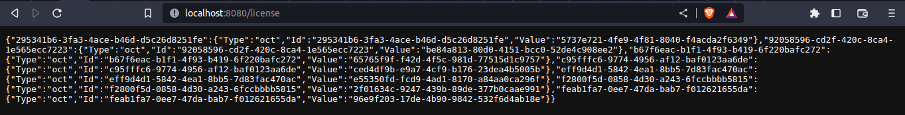
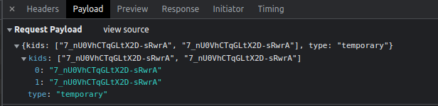
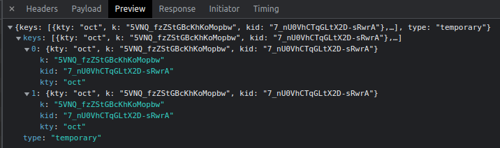
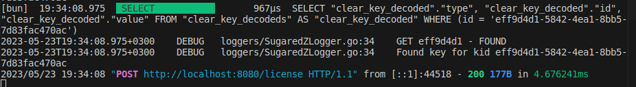

# ClearKey DRM With Shaka Player
This tutorial explains how to encode videos with HLS and encrypt them using ClearKeys and set up a ClearKey DRM Server to provide licenses for the video player.

# Getting Started

This tutorial is based around the [go-clearkey-server](https://github.com/diyeddin/go-clearkey-server) implementation.

## Prerequisites
- [Shaka Player](#shaka-player) - Video player
- [Shaka Packager](#shaka-packager) - Used in HLS encoding and encrypting the videos
- [Go](#go) - For building the ClearKey server
- [ClearKey](#clearkey) - DRM server
- [Docker](#docker) - For setting up the PostgreSQL database
- [Docker Compose](#docker-compose) - For setting up the database container
- [Psycopg Library](#psycopg-library) - For querying the database from Python

## Installing
- ### Shaka Player
    Clone the [Shaka Player]((https://github.com/shaka-project/shaka-player)) from the official repository and compile it according to the [documentation](https://shaka-player-demo.appspot.com/docs/api/tutorial-welcome.html).

- ### Shaka Packager
    Download the [binary](https://github.com/shaka-project/shaka-packager/releases) file and rename it to *packager* and add it to PATH.

- ### Go
    Install the Go language according to the [documentation](https://go.dev/doc/install).

- ### ClearKey
    Clone the forked repository of [ClearKey Server](https://github.com/diyeddin/go-clearkey-server) and compile it.
    ```bash
    cd ~/go-clearkey-server
    go run .
    ```

- ### Docker
    Follow the [documentation](https://docs.docker.com/engine/install/) to install the Docker Engine.

- ### Docker Compose
    Download the appropriate release of [Docker Compose](https://github.com/docker/compose/releases), rename it to *docker-compose* and move it to **/usr/local/bin** (for Linux users).

- ### Psycopg Library
    ```bash
    pip install psycopg2
    ```

## Usage
After installing all the required packages let's start by creating the PostgreSQL database by running docker-compose in the ClearKey server directory:
```bash
cd ~/go-clearkey-server
sudo docker-compose up -d
```
Now our PSQL server is running and ready to recieve connections.

To run the ClearKey Server we change to the servers directory and run this command:
```bash
cd ~/go-clearkey-server
go run .
```
Now our DRM Server is running and connected to our database.
We can check that by going to http://localhost:8080/license, we should start seeing the licenses if there's data in the database.


To HLS encode videos and encrypt them we can use **encode.py** that is provided in this repository. This script automates the encoding process and sends the encryption keys to the database. It's used as below:
```bash
python3 encode.py input_video.mp4 out_name
```
It should output the keyId and key values that it encoded the video with.

Now the ClearKey Server should be able to see the keyId and key pair and should provide the video player with the appropriate license.

This repository provides a website and its javascript code to test the video player. Make sure to provide the compiled shaka-player and the encoded video playlist in the same directory as the website.

# Examples
### Example request payload of Shaka Player


### Example response from ClearKey server


### What appears in the ClearKey server log after refreshing the website
Here the server is selecting the corresponding key for the requested key id


# Acknowledgments
- A special thanks to the original owner of the [ClearKey Server](https://github.com/AlexandreBrg/go-clearkey-server) implementation!
